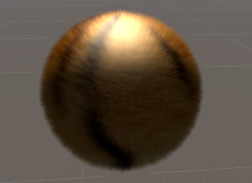

共8个小作业，从基础到慢慢深入，涵盖游戏开发所需的各个方面的基础知识。

hw1：Unity引擎入门实践

hw2：一个2d小游戏

hw3：一个完善的2d游戏，设计思路和资产来自[GitHub - tcy2002/Bridge: Python小游戏](https://github.com/tcy2002/Bridge)，并根据作业要求增加了一些新特性；在玩法上，将小车自动行进更改为由玩家手动控制。

hw4&5：一个完整的3d游戏，仿照Minecraft，主要是针对shader的实践，包含brdf、卡通、毛皮、水面、素描等基础shader，以及Bloom、运动模糊、雾效、景深等屏幕后处理shader

| 水面                         | 毛发                        | 素描                          |
| -------------------------- | ------------------------- | --------------------------- |
|  |   |  |
| **Bloom**                  | **运动模糊**                  | **雾效**                      |
|  |  |   |

hw6&7：基础物理仿真，包含毛发、布料模拟

|                               |                                |
| ----------------------------- | ------------------------------ |
|  |  |

hw8是一个简易的VR游戏，使用Google Cardboard VR框架

